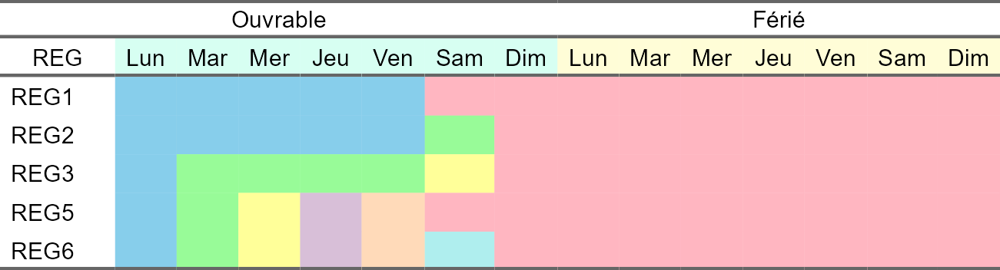
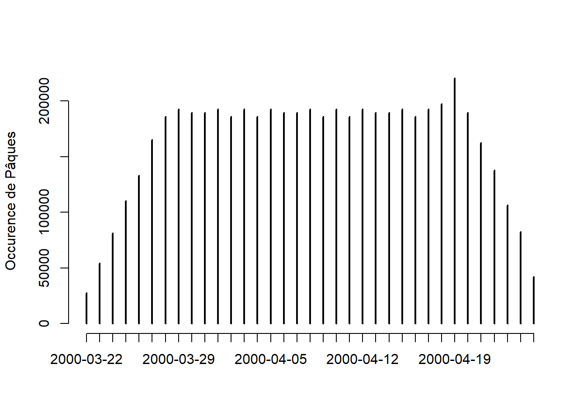
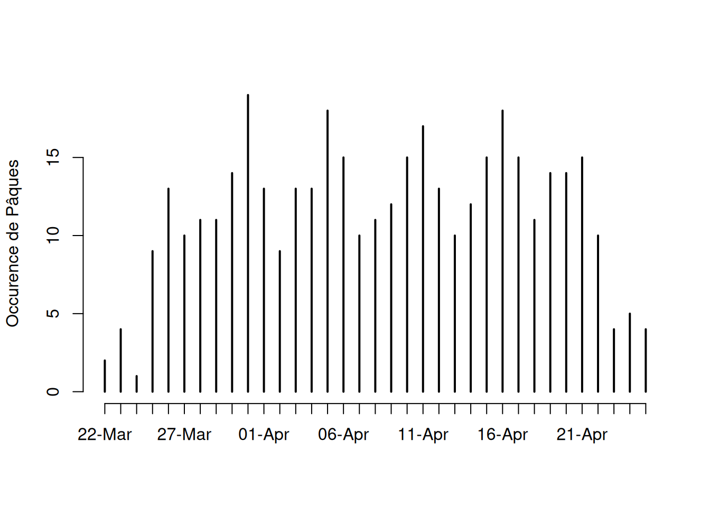
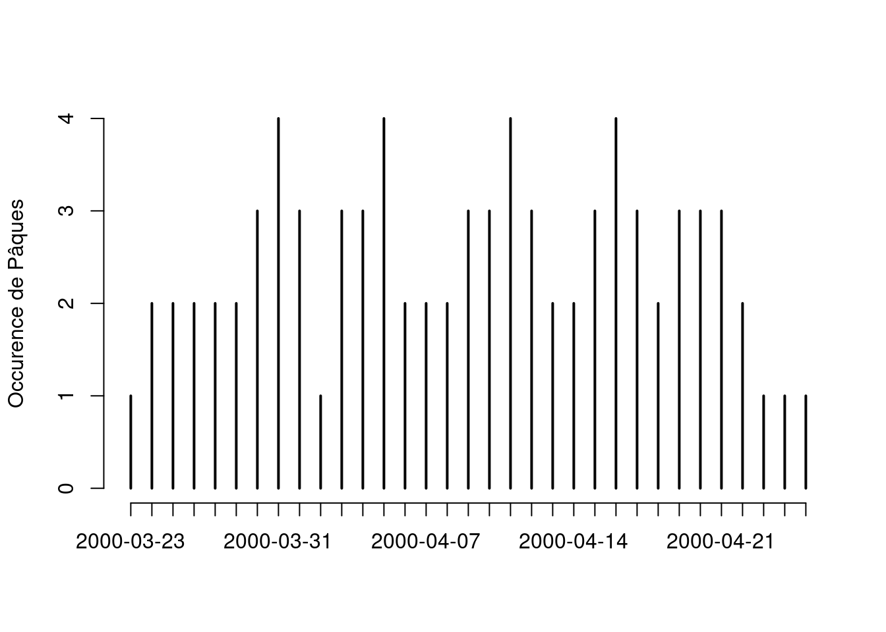

Comment créer des régresseurs de calendrier ?
================
Tanguy


    ## <environment: namespace:kableExtra>

    ## 
    ## Attaching package: 'dplyr'

    ## The following objects are masked from 'package:stats':
    ## 
    ##     filter, lag

    ## The following objects are masked from 'package:base':
    ## 
    ##     intersect, setdiff, setequal, union

## Divergence entre régresseurs Insee (**SAS**) et **RJD**

### Couleur des paragraphes

<div class="green">

Dans la suite, les paragraphes verts sont des exemples numériques.

</div>

<div class="blue">

Les paragraphes bleus font référence à ce qui se passe en pratique (sur
**SAS** ou **rjd3toolkit**).

</div>

### Notation

Dans la suite :

- $`i`$ désigne le jour de la semaine

- $`j`$ ou $`mois_j`$ désigne le numéro du mois de l’année

- $`t`$ désigne la date à laquelle on se trouve (croisement de $`j`$ et de
  l’anée)

### Préparation du calendrier

*Les formules appliquées ici sont expliquées dans la seconde partie du
document.*

- On compte les jours ($`NbDays`$ est le nombre total de jour du mois) :
  $`Day_{i}`$ est le nombre de jour n°i dans le mois ($`Day_1`$ est le
  dimanche, $`Day_2`$ le lundi, … $`Day_7`$ est le samedi)

- On compte les jours fériés $`Off_{i}`$ est le nombre de jour férié
  tombant un jour n°i dans le mois ($`Off_1`$ pour tous les dimanches,
  $`Off_2`$ les lundis, … et $`Off_7`$ les samedis)

- On distingue alors jours $`In`$ et jours $`Off`$ (selon fériés et
  vacances). En France la liste des jours $`Off`$ est :

  - 1er de l’an (1er janvier)
  - Lundi de Pâques
  - Jeudi de l’ascension
  - Lundi de pentecôte
  - Fête du travail (1er mai)
  - Armistice de 1945 (8 mai) mais uniquement depuis 1982
  - Fête nationale (14 juillet)
  - L’assomption (15 Août)
  - Toussaint (1 novembre)
  - Armistice de 1918 (11 novembre)
  - Noël (25 décembre)
  - les différents ponts (les lundi et vendredi à chaque fois qu’il y a
    un mardi ou un jeudi de férié) **ne sont pas considérés comme jours
    fériés**

Ainsi on peut définir les jours ouvrables $`In_{i} = Day_{i} - Off_{i}`$
pour $`i`$ entre 1 et 7.

- On créé les jours TD (tradings days) comme contrast par rapport à un
  référence (généralement le dimanche) : $`TD_{i} = Day_{i} - Day_1`$ pour
  $`i`$ entre 2 et 7. Par abus de notation, des fois i parcourt \[1, 6\]
  et non \[2, 7\] et alors 1 désigne le lundi et 6 le samedi.

- On créé la variable WD (working days) qui calcule un nombre moyen de
  jours travaillé (en contraste)

```math
 WD = \left(\sum_{i = 2}^{6} Day_{i}\right) - \frac{5}{2} \times \left(Day_1 + Day_7\right) 
```

On applique la formule plus générale :

```math
 reg_{i} = group_{i} - group_0 \times \frac{\#group_{i}}{\#group_0} 
```

avec ici $`i = 1`$ et $`group_1 = {2, 3, 4, 5, 6}`$, $`group_0 = {1, 7}`$,
$`\#x`$ le cardinal d’un ensemble.

- On créé les “Working week-days” = jours ouvrables (TD), en opposition
  les “Publics Holydays” (PH) et les “Weekday contrast” (Weekdays) :

```math
 TD = \sum_{i = 2}^{6} In_{i} 
```

```math
 PH = \sum_{i = 2}^{6} Off_{i} 
```

```math
 Weekdays = TD - \frac{5}{2} \times \left(PH + Day_1 + Day_7\right) 
```

Ces variables s’appuient sur la structure de REG1 (lundi au vendredi
contre samedi et dimanche).

### Retrait des moyennes de long-terme

- On va calculer les moyennes de long-terme pour les variables $`Day_{i}`$
  et les $`Off_{i}`$. Ces moyennes se calculent mois par mois :

```math
 mean\_Day_{i, j} = \sum_{annees} Day_{i, j} 
```

avec $`i`$ l’indice du jour de la semaine entre 1 et 7 et $`j`$ le numéro du
mois entre 1 et 12.

```math
 mean\_Off_{i, j} = \sum_{annees} Off_{i, j} 
```

avec $`i`$ l’indice du jour de la semaine entre 1 et 7 et $`j`$ le numéro du
mois entre 1 et 12

- On peut ensuite recalculer de nouvelles variables :
  $`Day_{i}\_corr = Day_{i} - mean\_Day_{i}`$,
  $`Off_{i}\_corr = Off_{i} - mean\_Off_{i}`$ et
  $`In_{i}\_corr = Day_{i}\_corr - Off_{i}\_corr`$.

Ainsi que toutes les autres variables présentées précédemment avec les
nouveaux $`Day_{i}\_corr`$, $`Off_{i}\_corr`$ et $`In_{i}\_corr`$.

<div class="blue">

Remarque : Pour les régresseurs calculés par *rjd3toolkit*, les moyennes
de long-terme sont calculés de manière théorique. On suppose que chaque
jour de l’année a autant de chance d’être un lundi, un mardi, …, un
dimanche. Ainsi les moyennes de long-termes sont calculées par une somme
de $`1/7`$.

Par exemple, pour les jours Off du mois de janvier, les moyennes de
long-terme des 7 types de jours valent $`1/7`$. Pour le mois de novembre,
c’est $`2/7`$.

Le calcul est aussi théorique pour les moyennes de la variable Day.
Ainsi on retire le 29ème jour de février (pour les années bissextiles)
pour laisser sont influence calculées par le régresseur LY (leap-year).

</div>

### Calcul des variables de régresseurs à partir des groupes

#### Présentation des différents jeux de régresseurs

Au total, on compte généralement 5 jeux de régresseurs. Un jeu de
régresseurs est composé d’un ensemble de groupe. Chaque groupe contient
des types de jours :

- le jeu REG1 créé 2 groupes de jours :
  - $`G_1`$ = jours ouvrables
  - $`G_0`$ = les autres
- le jeu REG2 créé 3 groupes de jours :
  - $`G_1`$ = jours ouvrables (sauf samedi)
  - $`G_2`$ = les samedis ouvrables
  - $`G_0`$ = les autres
- le jeu REG3 créé 3 groupes de jours :
  - $`G_1`$ = les lundis ouvrables
  - $`G_2`$ = jours ouvrables (sauflundi et samedi)
  - $`G_3`$ = les samedis ouvrables
  - $`G_0`$ = les autres
- le jeu REG5 créé 3 groupes de jours :
  - $`G_1`$ = les lundis ouvrables
  - $`G_2`$ = les mardis ouvrables
  - $`G_3`$ = les mercredis ouvrables
  - $`G_4`$ = les jeudis ouvrables
  - $`G_5`$ = les vendredis ouvrables
  - $`G_0`$ = les autres
- le jeu REG6 créé 7 groupes de jours
  - $`G_1`$ = lundi ouvrables
  - $`G_2`$ = mardi ouvrables
  - $`G_3`$ = mercredi ouvrables
  - $`G_4`$ = jeudi ouvrables
  - $`G_5`$ = vendredi ouvrables
  - $`G_6`$ = samedi ouvrables
  - $`G_0`$ = les autres)

<!-- -->

#### Calculs des jeux de régresseurs

Nous allons ensuite créer les régresseurs de calendrier comme variable
de contraste par rapport à une référence. On prend généralement le
groupe 0 comme groupe de référence. Ainsi pour un jeu de régresseurs qui
contient $`n`$ groupes, on calcule $`n-1`$ régresseurs.

Afin d’introduire de la comparabilité entre les groupes et avoir de
l’homogénéité dans nos contrastes, nous allons pondérer le groupe 0 à la
hauteur de la répartition du nombre de jour entre le groupe i et le
groupe 0.

Nos régresseurs s’écrivent ainsi :

```math
 REG_n\_AC_k = REG_k - \omega_k REG_0 
```

avec ici $`n`$ qui vaut 1, 3, 5, 6, … et $`k`$ entre 1 et $`n`$.

De manière générale, les $`\omega_k`$ sont calculés à partir de la taille
des groupes :

```math
 \omega_k = \frac{\# group_k}{\# group_0} 
```

<div class="blue">

- Pour les jeux de régresseurs issus de JD+ (*package*
  ***rjd3toolkit***), les $`\omega_k`$ sont calculés entre les jours
  d’une semaine classique. Ainsi, il y a 5 jours ouvrables (du lundi au
  vendredi) et 2 jours de week-end (samedi et dimanche).
  - pour REG6, $`\omega_k = 1`$ car chaque groupe $`G_{i}`$ ne contient
    qu’un jour (du lundi au dimanche)
  - pour REG1, $`\omega_k = \frac{5}{2}`$ car le groupe 1 $`G_1`$ (jours
    ouvrables) contient les jours du lundi au vendredi et le groupe 0
    $`G_0`$ contient le samedi et le dimanche.
  - … selon les configurations des groupes
- Pour les jeux de régresseurs issus des programmes **SAS**, les jours
  comptabilisés dans les pondérations sont les jours $`In`$ et les jours
  $`Off`$.
  - pour REG6, $`\omega_k = \frac{1}{8}`$ car chaque groupe $`G_k`$ (pour
    $`k \neq 0`$) ne contient qu’un seul jour alors que le groupe 0 $`G_0`$
    contient 8 jours dans le sens : 1 dimanche en semaine classique
    ($`In`$) et 7 jours en semaine férié / vacances ($`Off`$)
  - pour REG1, $`\omega_k = \frac{5}{9}`$ car le groupe 1 (jours
    ouvrables) contient 5 jours : les jours $`In`$ du lundi au vendredi et
    le groupe 0 $`G_0`$ contient le samedi et le dimanche en semaine
    classique ($`In`$) et 7 jours en semaine férié / vacances ($`Off`$).
  - … selon les configurations des groupes

Les espaces formés par la combinaison de chaque jeu de régressurs
(**RJD** ou **SAS**) sont les mêmes. Mais les coefficients seront
différents et interprétés différemment.

</div>

## Théorie et pratique

### Présentation du modèle théorique

Le modèle initial s’écrit :

```math
 \tag{1} D_t = \sum ^{7}_{i=1} \alpha _{i} \times Day_{i, t} 
```

Avec $`\alpha_{i}`$ l’effet du jour i (au moment t) sur notre variable. On
appelle $`D_t`$ l’effet déterministe du calendrier sur variable à étudier.

Malheureusement, ce modèle n’est pas utilisable directement comme ça car
:

- les régresseurs $`Day_{i, t}`$ sont fortements corrélés (exemple : le
  nombre de lundi dans un mois vaut toujours entre 3 et 5, comme tous
  les autres jours)

- les régresseurs sont saisonnier (exemple : en moyenne, il y aura plus
  de lundi en janvier qu’en février ou qu’en avril)

Aussi on remarque que  

```math
\sum ^{7}_{i=1} Day_{i, t} = NbDays_t
```


constant (par mois) sauf en février.

Pour contrer cela, on va chercher à séparer l’**effet cummulatif du
nombre total de jour du mois** de l’**effet net du nombre de type de
jour de la semaine** (exemple : nombre de lundi).

On réécrit l’équation en intégrant $`NbDays_t`$, le nombre de jour total
du mois et $`\overline{\alpha}`$ l’effet moyen d’un type de jour :

```math
 \tag{2} D_t = \overline{\alpha} \times NbDays_t + \sum ^{7}_{i=1} \beta_{i} \times Day_{i, t} 
```

Avec  

```math
\overline{\alpha} = \frac{1}{7} \sum ^{7}_{i=1} \alpha_{i}
```


$`\beta_{i} = \alpha _{i} - \overline{\alpha}`$

On remarque alors que  

```math
\sum ^{7}_{i=1} \beta_{i} = 0
```


 

```math
\beta_7 = -\sum ^{6}_{i=1} \beta_{i}
```


en constraste du dimanche (ou de n’importe quel autre jour) :

```math
 \tag{3} D_t = \overline{\alpha} \times NbDays_t + \sum ^{6}_{i=1} \beta_{i} \times (Day_{i, t} - Day_{7, t}) 
```

Ce modèle correspond *à peu près* au modèle REG6 mais on peut formuler
des hypothèses plus fortes pour créer de nouveaux jeux de régresseurs :

- Si je suppose que $`\beta_1 = \beta_2 = \beta_3 = \beta_4 = \beta_5`$ et
  $`\beta_6 = \beta_7`$, j’obtiens le modèle
   

```math
D_t = \overline{\alpha} \times NbDays_t + \beta_1 \times (\sum ^{5}_{i=1} Day_{i, t} - \frac{5}{2}(Day_{6, t} + Day_{7, t}))
```


  qui correpond au jeu de régresseurs REG1.

- Si je suppose que $`\beta_1 = \beta_2 = \beta_3 = \beta_4 = \beta_5`$,
  j’obtiens le modèle
   

```math
D_t = \overline{\alpha} \times NbDays_t + \beta_1 \times (\sum ^{5}_{i=1} Day_{i, t} - Day_{7, t}) + \beta_6 \times (Day_{6, t} - Day_{7, t})
```


  qui correpond au jeu de régresseurs REG2.

- …

Finalement quelque soit le jeu de régresseurs (regroupement de jour) que
l’on choisit, le modèle général s’écrit :

```math
 \tag{4} D_t = \beta_0 \times LY_t + \sum ^{n}_{k=1} \beta _{k} \times REC_{n}\_AC_{k, t} 
```

Avec $`LY_t`$ la variable relative aux années bissextiles, $`\beta_k`$ le
coefficient de régression relatif au régresseur $`REC_{n}\_AC_{k, t}`$.
$`\beta_0 = \overline{\alpha}`$ est l’effet moyen de chaque type de jour.

Attention : les régresseurs que l’on considère ($`REC_{n}\_AC_{k, t}`$,
$`LY_t`$) sont “désaisonnalisés” dans une certaine mesure. On leur a
retiré la moyenne de long-terme. Ainsi $`LY_t`$ diffère de $`NbDays_t`$ par
le retrait de sa moyenne de long-terme par mois et vaut 0 pour tous les
mois de l’année sauf pour février pour lequel $`LY_t`$ vaut -0.25 les
années non-bissetiles et 0.75 les années bissextiles.

Ainsi le modèle présenté ci-dessus (4), diffèrent des modèles (1), (2)
et (3) par le retrait d’un terme purement saisonnier.

Cette remarque est importante car elle conditionne notre interprétation
des coefficients. Le coefficient $`\beta_0`$ n’aura plus la même
interprétation que $`\overline{\alpha}`$ car le régresseur n’est plus le
même.

### Interprétation des coefficients

Finalement lorsqu’on a notre résultat final, on cherche à interpréter
les coefficients finaux et comprendre quel régresseur / jour de la
semaine participe.

Tout d’abord, comme on l’a vu entre l’étape (1) et (2), les coefficients
que l’on a à commenter sont les $`\beta_{i}`$ (ou $`\beta_k`$ quand on fait
des groupes) et non les $`\alpha_{i}`$. Donc on ne commente pas l’effet du
type de jour $`i`$ mais sa comparaison par rapport un type de jour moyen.
Cela explique que l’on peut avoir des coefficients négatifs pour des
types de jour où il y a de l’activité.

<div class="green">

Exemple : pour le tableau suivant :

| régresseur | Coefficients | T-Stat | P\[\|T\| \> t\] |
|:----------:|:------------:|:------:|:---------------:|
|   Lundi    |    0,0007    |  0,12  |     0,9032      |
|   Mardi    |    0,0066    |  0,89  |     0,3856      |
|  Mercredi  |    0,0136    |  1,93  |     0,2280      |
|   Jeudi    |    0,0090    |  1,25  |     0,2280      |
|  Vendredi  |   -0,0004    | -0,05  |     0,9632      |
|   Samedi   |   -0,0111    | -1,43  |     0,1715      |

Donc  

```math
\beta_7 = -\sum ^{6}_{k=1} \beta _{k} = -0,0184
```


coefficient du dimanche.

On aurait envie de commenter : *« L’ajout d’un samedi en plus dans le
mois* **fait baisser l’activité** *de 0.0111. Cela est contradictoire
avec le fait qu’il y a de l’activité le samedi donc un samedi en plus
dans le mois devrait* **faire augmenter l’activité***. »*

Cependant ce n’est pas vrai, ici on commente un effet en comparaison de
l’effet moyen d’un type de jour moyen. La bonne explication est la
suivante : *« Chaque mois a le même nombre de jour. L’ajout d’un samedi
dans le mois retire obligatoirement un autre jour du mois. Il y a des
jours où l’activité est plus intense qu’un samedi. Donc* **en
moyenne***, le jour que l’on retire aurait apporté plus d’activité.
L’ajout d’un samedi “en plus” (= à la place d’un jour moyen) dans le
mois a un impact négatif sur l’activité. »*

</div>

#### Remarque 1 : Les régresseurs sont désaisonnalisés

Comme on l’a vu entre les équations (3) et (4), on retire les moyennes
de long-terme. Ainsi les régresseurs ne sont pas EXACTEMENT des nombres
de jours mais ce sont des séries désaisonnalisées (sans leur moyenne de
long-terme par mois).

#### Remarque 2 : le choix la variable mise en contraste n’a pas d’importance.

Si on repart de l’équation (3), on remarque que le choix du dimanche en
constraste est un choix arbitraire. On peut donc réécrire l’équation de
REG1 (par exemple) en conséquence :

```math
 D_t = \overline{\alpha} \times NbDays_t - \frac{1}{5} \beta_7 \times (Day_{6, t} + Day_{7, t} - \frac{2}{5} \sum ^{5}_{i=1} Day_{i, t}) 
```

La réestimation de ce modèle donnera un $`\beta_7 = \beta_6`$ identique au
modèle REG1 écrit plus haut et les autres
$`\beta_{i} = -\frac{2}{5} \beta_7`$ (pour $`i`$ entre 1 et 5) seront aussi
les mêmes.

#### Remarque 3 : la réalité est plus complexe

Ici on a considéré un modèle simpliste. On a considéré que chaque jour
de l’année se partageait en 7 catégories (lundi, mardi, …, dimanche).
Seulement dans la réalité, les modèles de calendriers sont plus
complexes. Tout d’abord, on peut distinguer les jours $`In`$ (jours
ouvrés) et les jours $`Off`$ (jours fériés) : cela nous donne 14 types de
jour différents. On peut aussi considérer des modèles personnalisés
selon l’activité.

<div class="green">

Exemple : dans le transport routier, les camions peuvent rouler toute
l’année, jours ouvrés comme fériés. Seulement certains samedis, la
circulation des poids-lourds est interdite. Il faudrait idéalement,
créer un nouveau type de jour “samedi interdit” pour ces samedis.

</div>

## Remarques générales

### Ordre des opérations

Enfin on peut formuler une remarque sur l’ordre des opérations.

L’opération de calcul des moyennes prend une série (mensuelle ou
trimestrielle) et retire sa moyenne par période :

```math
 \overline{X} = I_1 \times (X - X\_{mean}_1) + I_2 \times (X - X\_{mean}_2) + ... + I_n \times (X - X\_{mean}_n) 
```

avec $`I_{i}`$ l’indicatrice de la période $`i`$ et $`n`$ le nombre total de
période (exemple $`n = 12`$ pour une fréquence mensuelle).

L’opération de contraste prend 2 séries et en fait une somme pondérée :

```math
 X\_contraste = X + \omega Y 
```

Ces deux opérations sont des opérateurs linéaires ainsi on peut alterner
ces 2 formules lors du calcul des constrastes :

```math
 \overline{X + \omega Y} = \overline{X} + \omega \overline{Y} 
```

### Occurence du premier de l’an

Les règles de création des calendriers sont stables dans le temps (on
sait quel jour tombera le 26 mars dans 450 ans). Ainsi on peut calculer
les fréquences des jours de la semaine.

Nombre d’occurence en 400 ans :

| Lundi | Mardi | Mercredi | Jeudi | Vendredi | Samedi | Dimanche |
|------:|------:|---------:|------:|---------:|-------:|---------:|
|    56 |    58 |       57 |    57 |       58 |     56 |       58 |

Fréquence d’apparition un premier de l’an :

| Lundi | Mardi | Mercredi |  Jeudi | Vendredi | Samedi | Dimanche |
|------:|------:|---------:|-------:|---------:|-------:|---------:|
|  0.14 | 0.145 |   0.1425 | 0.1425 |    0.145 |   0.14 |    0.145 |

### Fréquence de Pâques

On peut classer en 2 catégories les jours fériés français : - ceux qui
tombent chaque année à la même date (1er janvier, 25 décembre, …) - ceux
qui tombent chaque année sur le même type de jour (lundi, mardi, …) mais
à des dates différentes (lundi de Pâques, jeudi de l’ascension, …)

Il existe 3 jours fériés de la seconde catégories et ils dépendent tous
les 3 de la date de Pâques : lundi de Pâques, jeudi de l’ascension et
lundi de pentecôte.

Seulement la date de Pâques suit le calendrier lunaire. Et la fréquence
de Pâques (combinant calendrier grégorien et calendrier lunaire) est de
5700000 ans (ref.
[Wikipedia](https://en.wikipedia.org/wiki/Date_of_Easter), [Denis
Roegel](https://inria.hal.science/hal-01009457/PDF/roegel2014easter-bracelets.pdf),
[Histoire des jours
fériés](https://lagrandehistoireducalendrier.wordpress.com/tag/paques/)
et [OEIS](https://oeis.org/A348924/internal)).

La répartition des occurences de la date de Paques sur 5700000 ans est
la suivante :

<!-- -->

Mais cette répartition des jours de Pâques est différente selon la
période que l’on considère.

Sur la période 2000-2399 (cycle du calendrier) :

<!-- -->

Sur la période 1970-2050 (cycle du calendrier) :

<!-- -->

En comparant le nombre de jour fériés par mois :

| periode | type | 1-5700000 | 2000-2399 | 1970-2050 |
|--------:|-----:|----------:|----------:|----------:|
|       2 |    3 | 0.2000000 |    0.1875 | 0.1728395 |
|       2 |    4 | 0.8000000 |    0.8125 | 0.8271605 |
|       2 |    5 | 0.5995833 |    0.6000 | 0.5925926 |
|       2 |    6 | 0.4004167 |    0.4000 | 0.4074074 |
|       5 |    4 | 0.0048333 |    0.0050 |        NA |
|       5 |    5 | 0.9546316 |    0.9625 | 0.9629630 |
|       5 |    6 | 0.0405351 |    0.0325 | 0.0370370 |

Et par trimestre :

| periode | type | 1-5700000 | 2000-2399 | 1970-2050 |
|--------:|-----:|----------:|----------:|----------:|
|       2 |    1 |       0.2 |     0.195 | 0.1728395 |
|       2 |    2 |       1.8 |     1.805 | 1.8271605 |
|       5 |    2 |       1.0 |     1.000 | 1.0000000 |

Nos moyennes de long-terme diffèrent !

### Moyennes de long-terme

La remarque précédente est vraie pour tous les types de jours fériés.
Les autres jours fériés (hors Paques) sont périodiques de période 400
ans.

Mais est ce une raison pour prendre en compte la totalité de la série ou
peut-on se satisfaire d’un extrait avec les années sur lesquelles on
effectue nos analyses ?

| month_number | weekday_number |  Day.x |  Off.x |    Day.y |     Off.y |
|-------------:|---------------:|-------:|-------:|---------:|----------:|
|            1 |              1 | 4.4300 | 0.1450 | 4.432099 | 0.1358025 |
|            1 |              2 | 4.4250 | 0.1400 | 4.419753 | 0.1358025 |
|            1 |              3 | 4.4300 | 0.1450 | 4.419753 | 0.1481481 |
|            1 |              4 | 4.4275 | 0.1425 | 4.419753 | 0.1358025 |
|            1 |              5 | 4.4300 | 0.1425 | 4.432099 | 0.1481481 |
|            1 |              6 | 4.4300 | 0.1450 | 4.432099 | 0.1481481 |
|            1 |              7 | 4.4275 | 0.1400 | 4.444444 | 0.1481481 |
|           10 |              1 | 4.4250 | 0.0000 | 4.432099 | 0.0000000 |
|           10 |              2 | 4.4300 | 0.0000 | 4.432099 | 0.0000000 |
|           10 |              3 | 4.4275 | 0.0000 | 4.419753 | 0.0000000 |
|           10 |              4 | 4.4300 | 0.0000 | 4.419753 | 0.0000000 |
|           10 |              5 | 4.4300 | 0.0000 | 4.419753 | 0.0000000 |
|           10 |              6 | 4.4275 | 0.0000 | 4.432099 | 0.0000000 |
|           10 |              7 | 4.4300 | 0.0000 | 4.444444 | 0.0000000 |
|           11 |              1 | 4.2875 | 0.2900 | 4.283951 | 0.2962963 |
|           11 |              2 | 4.2850 | 0.2825 | 4.296296 | 0.2839506 |
|           11 |              3 | 4.2850 | 0.2875 | 4.296296 | 0.2839506 |
|           11 |              4 | 4.2850 | 0.2850 | 4.283951 | 0.2839506 |
|           11 |              5 | 4.2850 | 0.2850 | 4.283951 | 0.2962963 |
|           11 |              6 | 4.2875 | 0.2875 | 4.283951 | 0.2839506 |
|           11 |              7 | 4.2850 | 0.2825 | 4.271605 | 0.2716049 |
|           12 |              1 | 4.4275 | 0.1450 | 4.419753 | 0.1481481 |
|           12 |              2 | 4.4300 | 0.1400 | 4.419753 | 0.1358025 |
|           12 |              3 | 4.4300 | 0.1450 | 4.419753 | 0.1481481 |
|           12 |              4 | 4.4275 | 0.1425 | 4.432099 | 0.1358025 |
|           12 |              5 | 4.4300 | 0.1425 | 4.444444 | 0.1358025 |
|           12 |              6 | 4.4250 | 0.1450 | 4.432099 | 0.1481481 |
|           12 |              7 | 4.4300 | 0.1400 | 4.432099 | 0.1481481 |
|            2 |              1 | 4.0325 | 0.0000 | 4.037037 | 0.0000000 |
|            2 |              2 | 4.0375 | 0.0000 | 4.037037 | 0.0000000 |
|            2 |              3 | 4.0325 | 0.0000 | 4.037037 | 0.0000000 |
|            2 |              4 | 4.0375 | 0.0000 | 4.037037 | 0.0000000 |
|            2 |              5 | 4.0325 | 0.0000 | 4.024691 | 0.0000000 |
|            2 |              6 | 4.0350 | 0.0000 | 4.037037 | 0.0000000 |
|            2 |              7 | 4.0350 | 0.0000 | 4.037037 | 0.0000000 |
|            3 |              1 | 4.4300 | 0.0000 | 4.419753 | 0.0000000 |
|            3 |              2 | 4.4275 | 0.0000 | 4.432099 | 0.0000000 |
|            3 |              3 | 4.4300 | 0.0000 | 4.444444 | 0.0000000 |
|            3 |              4 | 4.4250 | 0.0000 | 4.432099 | 0.0000000 |
|            3 |              5 | 4.4300 | 0.0000 | 4.432099 | 0.0000000 |
|            3 |              6 | 4.4275 | 0.0000 | 4.419753 | 0.0000000 |
|            3 |              7 | 4.4300 | 0.0000 | 4.419753 | 0.0000000 |
|            4 |              1 | 4.2850 | 0.0000 | 4.283951 | 0.0000000 |
|            4 |              2 | 4.2875 | 0.0000 | 4.283951 | 0.0000000 |
|            4 |              3 | 4.2850 | 0.0000 | 4.271605 | 0.0000000 |
|            4 |              4 | 4.2875 | 0.0000 | 4.283951 | 0.0000000 |
|            4 |              5 | 4.2850 | 0.0000 | 4.296296 | 0.0000000 |
|            4 |              6 | 4.2850 | 0.0000 | 4.296296 | 0.0000000 |
|            4 |              7 | 4.2850 | 0.0000 | 4.283951 | 0.0000000 |
|            5 |              1 | 4.4300 | 0.2900 | 4.444444 | 0.2839506 |
|            5 |              2 | 4.4250 | 0.2800 | 4.432099 | 0.2469136 |
|            5 |              3 | 4.4300 | 0.2900 | 4.432099 | 0.2716049 |
|            5 |              4 | 4.4275 | 0.2850 | 4.419753 | 0.2592593 |
|            5 |              5 | 4.4300 | 0.2850 | 4.419753 | 0.2469136 |
|            5 |              6 | 4.4300 | 0.2900 | 4.419753 | 0.2716049 |
|            5 |              7 | 4.4275 | 0.2800 | 4.432099 | 0.2716049 |
|            6 |              1 | 4.2850 | 0.0000 | 4.271605 | 0.0000000 |
|            6 |              2 | 4.2875 | 0.0000 | 4.283951 | 0.0000000 |
|            6 |              3 | 4.2850 | 0.0000 | 4.296296 | 0.0000000 |
|            6 |              4 | 4.2850 | 0.0000 | 4.296296 | 0.0000000 |
|            6 |              5 | 4.2850 | 0.0000 | 4.283951 | 0.0000000 |
|            6 |              6 | 4.2850 | 0.0000 | 4.283951 | 0.0000000 |
|            6 |              7 | 4.2875 | 0.0000 | 4.283951 | 0.0000000 |
|            7 |              1 | 4.4300 | 0.1425 | 4.432099 | 0.1358025 |
|            7 |              2 | 4.4275 | 0.1425 | 4.419753 | 0.1358025 |
|            7 |              3 | 4.4300 | 0.1450 | 4.419753 | 0.1481481 |
|            7 |              4 | 4.4300 | 0.1400 | 4.419753 | 0.1481481 |
|            7 |              5 | 4.4275 | 0.1450 | 4.432099 | 0.1481481 |
|            7 |              6 | 4.4300 | 0.1400 | 4.444444 | 0.1358025 |
|            7 |              7 | 4.4250 | 0.1450 | 4.432099 | 0.1481481 |
|            8 |              1 | 4.4275 | 0.1400 | 4.432099 | 0.1481481 |
|            8 |              2 | 4.4300 | 0.1450 | 4.444444 | 0.1481481 |
|            8 |              3 | 4.4250 | 0.1400 | 4.432099 | 0.1358025 |
|            8 |              4 | 4.4300 | 0.1450 | 4.432099 | 0.1481481 |
|            8 |              5 | 4.4275 | 0.1425 | 4.419753 | 0.1358025 |
|            8 |              6 | 4.4300 | 0.1425 | 4.419753 | 0.1358025 |
|            8 |              7 | 4.4300 | 0.1450 | 4.419753 | 0.1481481 |
|            9 |              1 | 4.2875 | 0.0000 | 4.283951 | 0.0000000 |
|            9 |              2 | 4.2850 | 0.0000 | 4.271605 | 0.0000000 |
|            9 |              3 | 4.2875 | 0.0000 | 4.283951 | 0.0000000 |
|            9 |              4 | 4.2850 | 0.0000 | 4.296296 | 0.0000000 |
|            9 |              5 | 4.2850 | 0.0000 | 4.296296 | 0.0000000 |
|            9 |              6 | 4.2850 | 0.0000 | 4.283951 | 0.0000000 |
|            9 |              7 | 4.2850 | 0.0000 | 4.283951 | 0.0000000 |

### Calcul sous **SAS**

En **SAS**, le calcul de l’année bissextile se fait suivant des règles
particulières.

Règle classique : on considère que toutes les années divisibles par 4
sont bissextiles à l’exception des années divisibles par 100 mais pas
par 400.

<div class="green">

Exemple :

- Les années 2003, 2021 et 2027 ne sont pas bissextiles.
- Les années 2016, 2020 et 2024 sont bissextiles.
- Les années 2100, 2200 et 1900 ne sont pas bissextiles.
- Enfin, les années 2000, 1600 et 2400 sont bissextiles.

</div>

Ces règles permettent d’affiner la durée moyenne d’une année pour coller
avec la durée de révolution de la terre autour du soleil (durée qui
n’est pas un multiple de 24h…).

Sur 400 ans, une année moyenne dure 365.2425 jours = 8765.82 h =
31556952 s. La période de révolution du soleil dure environ 365.242190

Pour approcher un peu plus la période de révolution de la Terre, en SAS,
les années divisibles par 4000 sont non bissextiles. Cette règle n’est
pas la règle officielle et n’est pas compatibles avec les calculs de
date de Pâques (Gauss, Meeus, Conway…)

Pourtant, **SAS** utilise cette règle pour son calcul de calendrier !
Attention alors aux calculs des moyennes de long-terme sur ces
calendriers qui peuvent être faussé (notamment pour les jours fériés
relatifs à Pâques).

Ainsi en l’an 4000, il n’y a pas de 29 fevrier (alors qu’il devrait y en
avoir). Toutes les dates qui suivent le 28 février 4000 correspondent au
type de jour de leur veille.

<div class="green">

Exemple : Le lundi de Pâques tombe le 10 avril 4000, et bien le 10 avril
4000 sera alors (dans le calendrier de SAS) un dimanche.

</div>

Ainsi les jour férié ne changent pas de période (même année, même mois)
mais de type de jour !

Seulement en pratique, comme on l’a expliqué dans la remarque
précédente, il y a de grandes chances que les moyennes de long-terme ne
soit pas calculés sur des très grandes périodes.


Comment créer des régresseurs de calendrier ?
================
Tanguy


    ## <environment: namespace:kableExtra>

    ## 
    ## Attaching package: 'dplyr'

    ## The following objects are masked from 'package:stats':
    ## 
    ##     filter, lag

    ## The following objects are masked from 'package:base':
    ## 
    ##     intersect, setdiff, setequal, union

## Divergence entre régresseurs Insee (**SAS**) et **RJD**

### Couleur des paragraphes

<div class="green">

Dans la suite, les paragraphes verts sont des exemples numériques.

</div>

<div class="blue">

Les paragraphes bleus font référence à ce qui se passe en pratique (sur
**SAS** ou **rjd3toolkit**).

</div>

### Notation

Dans la suite :

- $`i`$ désigne le jour de la semaine

- $`j`$ ou $`mois_j`$ désigne le numéro du mois de l’année

- $`t`$ désigne la date à laquelle on se trouve (croisement de $`j`$ et de
  l’anée)

### Préparation du calendrier

*Les formules appliquées ici sont expliquées dans la seconde partie du
document.*

- On compte les jours ($`NbDays`$ est le nombre total de jour du mois) :
  $`Day_{i}`$ est le nombre de jour n°i dans le mois ($`Day_1`$ est le
  dimanche, $`Day_2`$ le lundi, … $`Day_7`$ est le samedi)

- On compte les jours fériés $`Off_{i}`$ est le nombre de jour férié
  tombant un jour n°i dans le mois ($`Off_1`$ pour tous les dimanches,
  $`Off_2`$ les lundis, … et $`Off_7`$ les samedis)

- On distingue alors jours $`In`$ et jours $`Off`$ (selon fériés et
  vacances). En France la liste des jours $`Off`$ est :

  - 1er de l’an (1er janvier)
  - Lundi de Pâques
  - Jeudi de l’ascension
  - Lundi de pentecôte
  - Fête du travail (1er mai)
  - Armistice de 1945 (8 mai) mais uniquement depuis 1982
  - Fête nationale (14 juillet)
  - L’assomption (15 Août)
  - Toussaint (1 novembre)
  - Armistice de 1918 (11 novembre)
  - Noël (25 décembre)
  - les différents ponts (les lundi et vendredi à chaque fois qu’il y a
    un mardi ou un jeudi de férié) **ne sont pas considérés comme jours
    fériés**

Ainsi on peut définir les jours ouvrables $`In_{i} = Day_{i} - Off_{i}`$
pour $`i`$ entre 1 et 7.

- On créé les jours TD (tradings days) comme contrast par rapport à un
  référence (généralement le dimanche) : $`TD_{i} = Day_{i} - Day_1`$ pour
  $`i`$ entre 2 et 7. Par abus de notation, des fois i parcourt \[1, 6\]
  et non \[2, 7\] et alors 1 désigne le lundi et 6 le samedi.

- On créé la variable WD (working days) qui calcule un nombre moyen de
  jours travaillé (en contraste)

```math
 WD = \left(\sum_{i = 2}^{6} Day_{i}\right) - \frac{5}{2} \times \left(Day_1 + Day_7\right) 
```

On applique la formule plus générale :

```math
 reg_{i} = group_{i} - group_0 \times \frac{\#group_{i}}{\#group_0} 
```

avec ici $`i = 1`$ et $`group_1 = {2, 3, 4, 5, 6}`$, $`group_0 = {1, 7}`$,
$`\#x`$ le cardinal d’un ensemble.

- On créé les “Working week-days” = jours ouvrables (TD), en opposition
  les “Publics Holydays” (PH) et les “Weekday contrast” (Weekdays) :

```math
 TD = \sum_{i = 2}^{6} In_{i} 
```

```math
 PH = \sum_{i = 2}^{6} Off_{i} 
```

```math
 Weekdays = TD - \frac{5}{2} \times \left(PH + Day_1 + Day_7\right) 
```

Ces variables s’appuient sur la structure de REG1 (lundi au vendredi
contre samedi et dimanche).

### Retrait des moyennes de long-terme

- On va calculer les moyennes de long-terme pour les variables $`Day_{i}`$
  et les $`Off_{i}`$. Ces moyennes se calculent mois par mois :

```math
 mean\_Day_{i, j} = \sum_{annees} Day_{i, j} 
```

avec $`i`$ l’indice du jour de la semaine entre 1 et 7 et $`j`$ le numéro du
mois entre 1 et 12.

```math
 mean\_Off_{i, j} = \sum_{annees} Off_{i, j} 
```

avec $`i`$ l’indice du jour de la semaine entre 1 et 7 et $`j`$ le numéro du
mois entre 1 et 12

- On peut ensuite recalculer de nouvelles variables :
  $`Day_{i}\_corr = Day_{i} - mean\_Day_{i}`$,
  $`Off_{i}\_corr = Off_{i} - mean\_Off_{i}`$ et
  $`In_{i}\_corr = Day_{i}\_corr - Off_{i}\_corr`$.

Ainsi que toutes les autres variables présentées précédemment avec les
nouveaux $`Day_{i}\_corr`$, $`Off_{i}\_corr`$ et $`In_{i}\_corr`$.

<div class="blue">

Remarque : Pour les régresseurs calculés par *rjd3toolkit*, les moyennes
de long-terme sont calculés de manière théorique. On suppose que chaque
jour de l’année a autant de chance d’être un lundi, un mardi, …, un
dimanche. Ainsi les moyennes de long-termes sont calculées par une somme
de $`1/7`$.

Par exemple, pour les jours Off du mois de janvier, les moyennes de
long-terme des 7 types de jours valent $`1/7`$. Pour le mois de novembre,
c’est $`2/7`$.

Le calcul est aussi théorique pour les moyennes de la variable Day.
Ainsi on retire le 29ème jour de février (pour les années bissextiles)
pour laisser sont influence calculées par le régresseur LY (leap-year).

</div>

### Calcul des variables de régresseurs à partir des groupes

#### Présentation des différents jeux de régresseurs

Au total, on compte généralement 5 jeux de régresseurs. Un jeu de
régresseurs est composé d’un ensemble de groupe. Chaque groupe contient
des types de jours :

- le jeu REG1 créé 2 groupes de jours :
  - $`G_1`$ = jours ouvrables
  - $`G_0`$ = les autres
- le jeu REG2 créé 3 groupes de jours :
  - $`G_1`$ = jours ouvrables (sauf samedi)
  - $`G_2`$ = les samedis ouvrables
  - $`G_0`$ = les autres
- le jeu REG3 créé 3 groupes de jours :
  - $`G_1`$ = les lundis ouvrables
  - $`G_2`$ = jours ouvrables (sauflundi et samedi)
  - $`G_3`$ = les samedis ouvrables
  - $`G_0`$ = les autres
- le jeu REG5 créé 3 groupes de jours :
  - $`G_1`$ = les lundis ouvrables
  - $`G_2`$ = les mardis ouvrables
  - $`G_3`$ = les mercredis ouvrables
  - $`G_4`$ = les jeudis ouvrables
  - $`G_5`$ = les vendredis ouvrables
  - $`G_0`$ = les autres
- le jeu REG6 créé 7 groupes de jours
  - $`G_1`$ = lundi ouvrables
  - $`G_2`$ = mardi ouvrables
  - $`G_3`$ = mercredi ouvrables
  - $`G_4`$ = jeudi ouvrables
  - $`G_5`$ = vendredi ouvrables
  - $`G_6`$ = samedi ouvrables
  - $`G_0`$ = les autres)

<!-- -->

#### Calculs des jeux de régresseurs

Nous allons ensuite créer les régresseurs de calendrier comme variable
de contraste par rapport à une référence. On prend généralement le
groupe 0 comme groupe de référence. Ainsi pour un jeu de régresseurs qui
contient $`n`$ groupes, on calcule $`n-1`$ régresseurs.

Afin d’introduire de la comparabilité entre les groupes et avoir de
l’homogénéité dans nos contrastes, nous allons pondérer le groupe 0 à la
hauteur de la répartition du nombre de jour entre le groupe i et le
groupe 0.

Nos régresseurs s’écrivent ainsi :

```math
 REG_n\_AC_k = REG_k - \omega_k REG_0 
```

avec ici $`n`$ qui vaut 1, 3, 5, 6, … et $`k`$ entre 1 et $`n`$.

De manière générale, les $`\omega_k`$ sont calculés à partir de la taille
des groupes :

```math
 \omega_k = \frac{\# group_k}{\# group_0} 
```

<div class="blue">

- Pour les jeux de régresseurs issus de JD+ (*package*
  ***rjd3toolkit***), les $`\omega_k`$ sont calculés entre les jours
  d’une semaine classique. Ainsi, il y a 5 jours ouvrables (du lundi au
  vendredi) et 2 jours de week-end (samedi et dimanche).
  - pour REG6, $`\omega_k = 1`$ car chaque groupe $`G_{i}`$ ne contient
    qu’un jour (du lundi au dimanche)
  - pour REG1, $`\omega_k = \frac{5}{2}`$ car le groupe 1 $`G_1`$ (jours
    ouvrables) contient les jours du lundi au vendredi et le groupe 0
    $`G_0`$ contient le samedi et le dimanche.
  - … selon les configurations des groupes
- Pour les jeux de régresseurs issus des programmes **SAS**, les jours
  comptabilisés dans les pondérations sont les jours $`In`$ et les jours
  $`Off`$.
  - pour REG6, $`\omega_k = \frac{1}{8}`$ car chaque groupe $`G_k`$ (pour
    $`k \neq 0`$) ne contient qu’un seul jour alors que le groupe 0 $`G_0`$
    contient 8 jours dans le sens : 1 dimanche en semaine classique
    ($`In`$) et 7 jours en semaine férié / vacances ($`Off`$)
  - pour REG1, $`\omega_k = \frac{5}{9}`$ car le groupe 1 (jours
    ouvrables) contient 5 jours : les jours $`In`$ du lundi au vendredi et
    le groupe 0 $`G_0`$ contient le samedi et le dimanche en semaine
    classique ($`In`$) et 7 jours en semaine férié / vacances ($`Off`$).
  - … selon les configurations des groupes

Les espaces formés par la combinaison de chaque jeu de régressurs
(**RJD** ou **SAS**) sont les mêmes. Mais les coefficients seront
différents et interprétés différemment.

</div>

## Théorie et pratique

### Présentation du modèle théorique

Le modèle initial s’écrit :

```math
 \tag{1} D_t = \sum ^{7}_{i=1} \alpha _{i} \times Day_{i, t} 
```

Avec $`\alpha_{i}`$ l’effet du jour i (au moment t) sur notre variable. On
appelle $`D_t`$ l’effet déterministe du calendrier sur variable à étudier.

Malheureusement, ce modèle n’est pas utilisable directement comme ça car
:

- les régresseurs $`Day_{i, t}`$ sont fortements corrélés (exemple : le
  nombre de lundi dans un mois vaut toujours entre 3 et 5, comme tous
  les autres jours)

- les régresseurs sont saisonnier (exemple : en moyenne, il y aura plus
  de lundi en janvier qu’en février ou qu’en avril)

 est 
constant (par mois) sauf en février.

Pour contrer cela, on va chercher à séparer l’**effet cummulatif du
nombre total de jour du mois** de l’**effet net du nombre de type de
jour de la semaine** (exemple : nombre de lundi).

On réécrit l’équation en intégrant $`NbDays_t`$, le nombre de jour total
du mois et $`\overline{\alpha}`$ l’effet moyen d’un type de jour :

```math
 \tag{2} D_t = \overline{\alpha} \times NbDays_t + \sum ^{7}_{i=1} \beta_{i} \times Day_{i, t} 
```

 et 
$`\beta_{i} = \alpha _{i} - \overline{\alpha}`$

. Donc 
 et on peut écrire nos régresseurs 
en constraste du dimanche (ou de n’importe quel autre jour) :

```math
 \tag{3} D_t = \overline{\alpha} \times NbDays_t + \sum ^{6}_{i=1} \beta_{i} \times (Day_{i, t} - Day_{7, t}) 
```

Ce modèle correspond *à peu près* au modèle REG6 mais on peut formuler
des hypothèses plus fortes pour créer de nouveaux jeux de régresseurs :

- Si je suppose que $`\beta_1 = \beta_2 = \beta_3 = \beta_4 = \beta_5`$ et
  $`\beta_6 = \beta_7`$, j’obtiens le modèle
 
  qui correpond au jeu de régresseurs REG1.

- Si je suppose que $`\beta_1 = \beta_2 = \beta_3 = \beta_4 = \beta_5`$,
  j’obtiens le modèle
 
  qui correpond au jeu de régresseurs REG2.

- …

Finalement quelque soit le jeu de régresseurs (regroupement de jour) que
l’on choisit, le modèle général s’écrit :

```math
 \tag{4} D_t = \beta_0 \times LY_t + \sum ^{n}_{k=1} \beta _{k} \times REC_{n}\_AC_{k, t} 
```

Avec $`LY_t`$ la variable relative aux années bissextiles, $`\beta_k`$ le
coefficient de régression relatif au régresseur $`REC_{n}\_AC_{k, t}`$.
$`\beta_0 = \overline{\alpha}`$ est l’effet moyen de chaque type de jour.

Attention : les régresseurs que l’on considère ($`REC_{n}\_AC_{k, t}`$,
$`LY_t`$) sont “désaisonnalisés” dans une certaine mesure. On leur a
retiré la moyenne de long-terme. Ainsi $`LY_t`$ diffère de $`NbDays_t`$ par
le retrait de sa moyenne de long-terme par mois et vaut 0 pour tous les
mois de l’année sauf pour février pour lequel $`LY_t`$ vaut -0.25 les
années non-bissetiles et 0.75 les années bissextiles.

Ainsi le modèle présenté ci-dessus (4), diffèrent des modèles (1), (2)
et (3) par le retrait d’un terme purement saisonnier.

Cette remarque est importante car elle conditionne notre interprétation
des coefficients. Le coefficient $`\beta_0`$ n’aura plus la même
interprétation que $`\overline{\alpha}`$ car le régresseur n’est plus le
même.

### Interprétation des coefficients

Finalement lorsqu’on a notre résultat final, on cherche à interpréter
les coefficients finaux et comprendre quel régresseur / jour de la
semaine participe.

Tout d’abord, comme on l’a vu entre l’étape (1) et (2), les coefficients
que l’on a à commenter sont les $`\beta_{i}`$ (ou $`\beta_k`$ quand on fait
des groupes) et non les $`\alpha_{i}`$. Donc on ne commente pas l’effet du
type de jour $`i`$ mais sa comparaison par rapport un type de jour moyen.
Cela explique que l’on peut avoir des coefficients négatifs pour des
types de jour où il y a de l’activité.

<div class="green">

Exemple : pour le tableau suivant :

| régresseur | Coefficients | T-Stat | P\[\|T\| \> t\] |
|:----------:|:------------:|:------:|:---------------:|
|   Lundi    |    0,0007    |  0,12  |     0,9032      |
|   Mardi    |    0,0066    |  0,89  |     0,3856      |
|  Mercredi  |    0,0136    |  1,93  |     0,2280      |
|   Jeudi    |    0,0090    |  1,25  |     0,2280      |
|  Vendredi  |   -0,0004    | -0,05  |     0,9632      |
|   Samedi   |   -0,0111    | -1,43  |     0,1715      |

 pour le 
coefficient du dimanche.

On aurait envie de commenter : *« L’ajout d’un samedi en plus dans le
mois* **fait baisser l’activité** *de 0.0111. Cela est contradictoire
avec le fait qu’il y a de l’activité le samedi donc un samedi en plus
dans le mois devrait* **faire augmenter l’activité***. »*

Cependant ce n’est pas vrai, ici on commente un effet en comparaison de
l’effet moyen d’un type de jour moyen. La bonne explication est la
suivante : *« Chaque mois a le même nombre de jour. L’ajout d’un samedi
dans le mois retire obligatoirement un autre jour du mois. Il y a des
jours où l’activité est plus intense qu’un samedi. Donc* **en
moyenne***, le jour que l’on retire aurait apporté plus d’activité.
L’ajout d’un samedi “en plus” (= à la place d’un jour moyen) dans le
mois a un impact négatif sur l’activité. »*

</div>

#### Remarque 1 : Les régresseurs sont désaisonnalisés

Comme on l’a vu entre les équations (3) et (4), on retire les moyennes
de long-terme. Ainsi les régresseurs ne sont pas EXACTEMENT des nombres
de jours mais ce sont des séries désaisonnalisées (sans leur moyenne de
long-terme par mois).

#### Remarque 2 : le choix la variable mise en contraste n’a pas d’importance.

Si on repart de l’équation (3), on remarque que le choix du dimanche en
constraste est un choix arbitraire. On peut donc réécrire l’équation de
REG1 (par exemple) en conséquence :

```math
 D_t = \overline{\alpha} \times NbDays_t - \frac{1}{5} \beta_7 \times (Day_{6, t} + Day_{7, t} - \frac{2}{5} \sum ^{5}_{i=1} Day_{i, t}) 
```

La réestimation de ce modèle donnera un $`\beta_7 = \beta_6`$ identique au
modèle REG1 écrit plus haut et les autres
$`\beta_{i} = -\frac{2}{5} \beta_7`$ (pour $`i`$ entre 1 et 5) seront aussi
les mêmes.

#### Remarque 3 : la réalité est plus complexe

Ici on a considéré un modèle simpliste. On a considéré que chaque jour
de l’année se partageait en 7 catégories (lundi, mardi, …, dimanche).
Seulement dans la réalité, les modèles de calendriers sont plus
complexes. Tout d’abord, on peut distinguer les jours $`In`$ (jours
ouvrés) et les jours $`Off`$ (jours fériés) : cela nous donne 14 types de
jour différents. On peut aussi considérer des modèles personnalisés
selon l’activité.

<div class="green">

Exemple : dans le transport routier, les camions peuvent rouler toute
l’année, jours ouvrés comme fériés. Seulement certains samedis, la
circulation des poids-lourds est interdite. Il faudrait idéalement,
créer un nouveau type de jour “samedi interdit” pour ces samedis.

</div>

## Remarques générales

### Ordre des opérations

Enfin on peut formuler une remarque sur l’ordre des opérations.

L’opération de calcul des moyennes prend une série (mensuelle ou
trimestrielle) et retire sa moyenne par période :

```math
 \overline{X} = I_1 \times (X - X\_{mean}_1) + I_2 \times (X - X\_{mean}_2) + ... + I_n \times (X - X\_{mean}_n) 
```

avec $`I_{i}`$ l’indicatrice de la période $`i`$ et $`n`$ le nombre total de
période (exemple $`n = 12`$ pour une fréquence mensuelle).

L’opération de contraste prend 2 séries et en fait une somme pondérée :

```math
 X\_contraste = X + \omega Y 
```

Ces deux opérations sont des opérateurs linéaires ainsi on peut alterner
ces 2 formules lors du calcul des constrastes :

```math
 \overline{X + \omega Y} = \overline{X} + \omega \overline{Y} 
```

### Occurence du premier de l’an

Les règles de création des calendriers sont stables dans le temps (on
sait quel jour tombera le 26 mars dans 450 ans). Ainsi on peut calculer
les fréquences des jours de la semaine.

Nombre d’occurence en 400 ans :

| Lundi | Mardi | Mercredi | Jeudi | Vendredi | Samedi | Dimanche |
|------:|------:|---------:|------:|---------:|-------:|---------:|
|    56 |    58 |       57 |    57 |       58 |     56 |       58 |

Fréquence d’apparition un premier de l’an :

| Lundi | Mardi | Mercredi |  Jeudi | Vendredi | Samedi | Dimanche |
|------:|------:|---------:|-------:|---------:|-------:|---------:|
|  0.14 | 0.145 |   0.1425 | 0.1425 |    0.145 |   0.14 |    0.145 |

### Fréquence de Pâques

On peut classer en 2 catégories les jours fériés français : - ceux qui
tombent chaque année à la même date (1er janvier, 25 décembre, …) - ceux
qui tombent chaque année sur le même type de jour (lundi, mardi, …) mais
à des dates différentes (lundi de Pâques, jeudi de l’ascension, …)

Il existe 3 jours fériés de la seconde catégories et ils dépendent tous
les 3 de la date de Pâques : lundi de Pâques, jeudi de l’ascension et
lundi de pentecôte.

Seulement la date de Pâques suit le calendrier lunaire. Et la fréquence
de Pâques (combinant calendrier grégorien et calendrier lunaire) est de
5700000 ans (ref.
[Wikipedia](https://en.wikipedia.org/wiki/Date_of_Easter), [Denis
Roegel](https://inria.hal.science/hal-01009457/PDF/roegel2014easter-bracelets.pdf),
[Histoire des jours
fériés](https://lagrandehistoireducalendrier.wordpress.com/tag/paques/)
et [OEIS](https://oeis.org/A348924/internal)).

La répartition des occurences de la date de Paques sur 5700000 ans est
la suivante :

<!-- -->

Mais cette répartition des jours de Pâques est différente selon la
période que l’on considère.

Sur la période 2000-2399 (cycle du calendrier) :

<!-- -->

Sur la période 1970-2050 (cycle du calendrier) :

<!-- -->

En comparant le nombre de jour fériés par mois :

| periode | type | 1-5700000 | 2000-2399 | 1970-2050 |
|--------:|-----:|----------:|----------:|----------:|
|       2 |    3 | 0.2000000 |    0.1875 | 0.1728395 |
|       2 |    4 | 0.8000000 |    0.8125 | 0.8271605 |
|       2 |    5 | 0.5995833 |    0.6000 | 0.5925926 |
|       2 |    6 | 0.4004167 |    0.4000 | 0.4074074 |
|       5 |    4 | 0.0048333 |    0.0050 |        NA |
|       5 |    5 | 0.9546316 |    0.9625 | 0.9629630 |
|       5 |    6 | 0.0405351 |    0.0325 | 0.0370370 |

Et par trimestre :

| periode | type | 1-5700000 | 2000-2399 | 1970-2050 |
|--------:|-----:|----------:|----------:|----------:|
|       2 |    1 |       0.2 |     0.195 | 0.1728395 |
|       2 |    2 |       1.8 |     1.805 | 1.8271605 |
|       5 |    2 |       1.0 |     1.000 | 1.0000000 |

Nos moyennes de long-terme diffèrent !

### Moyennes de long-terme

La remarque précédente est vraie pour tous les types de jours fériés.
Les autres jours fériés (hors Paques) sont périodiques de période 400
ans.

Mais est ce une raison pour prendre en compte la totalité de la série ou
peut-on se satisfaire d’un extrait avec les années sur lesquelles on
effectue nos analyses ?

| month_number | weekday_number |  Day.x |  Off.x |    Day.y |     Off.y |
|-------------:|---------------:|-------:|-------:|---------:|----------:|
|            1 |              1 | 4.4300 | 0.1450 | 4.432099 | 0.1358025 |
|            1 |              2 | 4.4250 | 0.1400 | 4.419753 | 0.1358025 |
|            1 |              3 | 4.4300 | 0.1450 | 4.419753 | 0.1481481 |
|            1 |              4 | 4.4275 | 0.1425 | 4.419753 | 0.1358025 |
|            1 |              5 | 4.4300 | 0.1425 | 4.432099 | 0.1481481 |
|            1 |              6 | 4.4300 | 0.1450 | 4.432099 | 0.1481481 |
|            1 |              7 | 4.4275 | 0.1400 | 4.444444 | 0.1481481 |
|           10 |              1 | 4.4250 | 0.0000 | 4.432099 | 0.0000000 |
|           10 |              2 | 4.4300 | 0.0000 | 4.432099 | 0.0000000 |
|           10 |              3 | 4.4275 | 0.0000 | 4.419753 | 0.0000000 |
|           10 |              4 | 4.4300 | 0.0000 | 4.419753 | 0.0000000 |
|           10 |              5 | 4.4300 | 0.0000 | 4.419753 | 0.0000000 |
|           10 |              6 | 4.4275 | 0.0000 | 4.432099 | 0.0000000 |
|           10 |              7 | 4.4300 | 0.0000 | 4.444444 | 0.0000000 |
|           11 |              1 | 4.2875 | 0.2900 | 4.283951 | 0.2962963 |
|           11 |              2 | 4.2850 | 0.2825 | 4.296296 | 0.2839506 |
|           11 |              3 | 4.2850 | 0.2875 | 4.296296 | 0.2839506 |
|           11 |              4 | 4.2850 | 0.2850 | 4.283951 | 0.2839506 |
|           11 |              5 | 4.2850 | 0.2850 | 4.283951 | 0.2962963 |
|           11 |              6 | 4.2875 | 0.2875 | 4.283951 | 0.2839506 |
|           11 |              7 | 4.2850 | 0.2825 | 4.271605 | 0.2716049 |
|           12 |              1 | 4.4275 | 0.1450 | 4.419753 | 0.1481481 |
|           12 |              2 | 4.4300 | 0.1400 | 4.419753 | 0.1358025 |
|           12 |              3 | 4.4300 | 0.1450 | 4.419753 | 0.1481481 |
|           12 |              4 | 4.4275 | 0.1425 | 4.432099 | 0.1358025 |
|           12 |              5 | 4.4300 | 0.1425 | 4.444444 | 0.1358025 |
|           12 |              6 | 4.4250 | 0.1450 | 4.432099 | 0.1481481 |
|           12 |              7 | 4.4300 | 0.1400 | 4.432099 | 0.1481481 |
|            2 |              1 | 4.0325 | 0.0000 | 4.037037 | 0.0000000 |
|            2 |              2 | 4.0375 | 0.0000 | 4.037037 | 0.0000000 |
|            2 |              3 | 4.0325 | 0.0000 | 4.037037 | 0.0000000 |
|            2 |              4 | 4.0375 | 0.0000 | 4.037037 | 0.0000000 |
|            2 |              5 | 4.0325 | 0.0000 | 4.024691 | 0.0000000 |
|            2 |              6 | 4.0350 | 0.0000 | 4.037037 | 0.0000000 |
|            2 |              7 | 4.0350 | 0.0000 | 4.037037 | 0.0000000 |
|            3 |              1 | 4.4300 | 0.0000 | 4.419753 | 0.0000000 |
|            3 |              2 | 4.4275 | 0.0000 | 4.432099 | 0.0000000 |
|            3 |              3 | 4.4300 | 0.0000 | 4.444444 | 0.0000000 |
|            3 |              4 | 4.4250 | 0.0000 | 4.432099 | 0.0000000 |
|            3 |              5 | 4.4300 | 0.0000 | 4.432099 | 0.0000000 |
|            3 |              6 | 4.4275 | 0.0000 | 4.419753 | 0.0000000 |
|            3 |              7 | 4.4300 | 0.0000 | 4.419753 | 0.0000000 |
|            4 |              1 | 4.2850 | 0.0000 | 4.283951 | 0.0000000 |
|            4 |              2 | 4.2875 | 0.0000 | 4.283951 | 0.0000000 |
|            4 |              3 | 4.2850 | 0.0000 | 4.271605 | 0.0000000 |
|            4 |              4 | 4.2875 | 0.0000 | 4.283951 | 0.0000000 |
|            4 |              5 | 4.2850 | 0.0000 | 4.296296 | 0.0000000 |
|            4 |              6 | 4.2850 | 0.0000 | 4.296296 | 0.0000000 |
|            4 |              7 | 4.2850 | 0.0000 | 4.283951 | 0.0000000 |
|            5 |              1 | 4.4300 | 0.2900 | 4.444444 | 0.2839506 |
|            5 |              2 | 4.4250 | 0.2800 | 4.432099 | 0.2469136 |
|            5 |              3 | 4.4300 | 0.2900 | 4.432099 | 0.2716049 |
|            5 |              4 | 4.4275 | 0.2850 | 4.419753 | 0.2592593 |
|            5 |              5 | 4.4300 | 0.2850 | 4.419753 | 0.2469136 |
|            5 |              6 | 4.4300 | 0.2900 | 4.419753 | 0.2716049 |
|            5 |              7 | 4.4275 | 0.2800 | 4.432099 | 0.2716049 |
|            6 |              1 | 4.2850 | 0.0000 | 4.271605 | 0.0000000 |
|            6 |              2 | 4.2875 | 0.0000 | 4.283951 | 0.0000000 |
|            6 |              3 | 4.2850 | 0.0000 | 4.296296 | 0.0000000 |
|            6 |              4 | 4.2850 | 0.0000 | 4.296296 | 0.0000000 |
|            6 |              5 | 4.2850 | 0.0000 | 4.283951 | 0.0000000 |
|            6 |              6 | 4.2850 | 0.0000 | 4.283951 | 0.0000000 |
|            6 |              7 | 4.2875 | 0.0000 | 4.283951 | 0.0000000 |
|            7 |              1 | 4.4300 | 0.1425 | 4.432099 | 0.1358025 |
|            7 |              2 | 4.4275 | 0.1425 | 4.419753 | 0.1358025 |
|            7 |              3 | 4.4300 | 0.1450 | 4.419753 | 0.1481481 |
|            7 |              4 | 4.4300 | 0.1400 | 4.419753 | 0.1481481 |
|            7 |              5 | 4.4275 | 0.1450 | 4.432099 | 0.1481481 |
|            7 |              6 | 4.4300 | 0.1400 | 4.444444 | 0.1358025 |
|            7 |              7 | 4.4250 | 0.1450 | 4.432099 | 0.1481481 |
|            8 |              1 | 4.4275 | 0.1400 | 4.432099 | 0.1481481 |
|            8 |              2 | 4.4300 | 0.1450 | 4.444444 | 0.1481481 |
|            8 |              3 | 4.4250 | 0.1400 | 4.432099 | 0.1358025 |
|            8 |              4 | 4.4300 | 0.1450 | 4.432099 | 0.1481481 |
|            8 |              5 | 4.4275 | 0.1425 | 4.419753 | 0.1358025 |
|            8 |              6 | 4.4300 | 0.1425 | 4.419753 | 0.1358025 |
|            8 |              7 | 4.4300 | 0.1450 | 4.419753 | 0.1481481 |
|            9 |              1 | 4.2875 | 0.0000 | 4.283951 | 0.0000000 |
|            9 |              2 | 4.2850 | 0.0000 | 4.271605 | 0.0000000 |
|            9 |              3 | 4.2875 | 0.0000 | 4.283951 | 0.0000000 |
|            9 |              4 | 4.2850 | 0.0000 | 4.296296 | 0.0000000 |
|            9 |              5 | 4.2850 | 0.0000 | 4.296296 | 0.0000000 |
|            9 |              6 | 4.2850 | 0.0000 | 4.283951 | 0.0000000 |
|            9 |              7 | 4.2850 | 0.0000 | 4.283951 | 0.0000000 |

### Calcul sous **SAS**

En **SAS**, le calcul de l’année bissextile se fait suivant des règles
particulières.

Règle classique : on considère que toutes les années divisibles par 4
sont bissextiles à l’exception des années divisibles par 100 mais pas
par 400.

<div class="green">

Exemple :

- Les années 2003, 2021 et 2027 ne sont pas bissextiles.
- Les années 2016, 2020 et 2024 sont bissextiles.
- Les années 2100, 2200 et 1900 ne sont pas bissextiles.
- Enfin, les années 2000, 1600 et 2400 sont bissextiles.

</div>

Ces règles permettent d’affiner la durée moyenne d’une année pour coller
avec la durée de révolution de la terre autour du soleil (durée qui
n’est pas un multiple de 24h…).

Sur 400 ans, une année moyenne dure 365.2425 jours = 8765.82 h =
31556952 s. La période de révolution du soleil dure environ 365.242190

Pour approcher un peu plus la période de révolution de la Terre, en SAS,
les années divisibles par 4000 sont non bissextiles. Cette règle n’est
pas la règle officielle et n’est pas compatibles avec les calculs de
date de Pâques (Gauss, Meeus, Conway…)

Pourtant, **SAS** utilise cette règle pour son calcul de calendrier !
Attention alors aux calculs des moyennes de long-terme sur ces
calendriers qui peuvent être faussé (notamment pour les jours fériés
relatifs à Pâques).

Ainsi en l’an 4000, il n’y a pas de 29 fevrier (alors qu’il devrait y en
avoir). Toutes les dates qui suivent le 28 février 4000 correspondent au
type de jour de leur veille.

<div class="green">

Exemple : Le lundi de Pâques tombe le 10 avril 4000, et bien le 10 avril
4000 sera alors (dans le calendrier de SAS) un dimanche.

</div>

Ainsi les jour férié ne changent pas de période (même année, même mois)
mais de type de jour !

Seulement en pratique, comme on l’a expliqué dans la remarque
précédente, il y a de grandes chances que les moyennes de long-terme ne
soit pas calculés sur des très grandes périodes.


